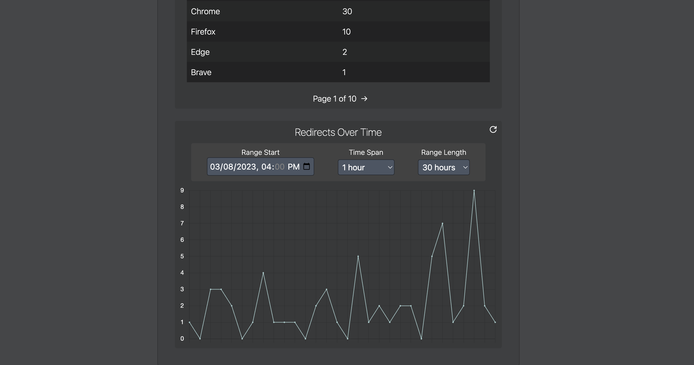

# Conditional URL

## Description
[Conditional URL](https://conditionalurl.web.app) is a URL shortener that creates a shortened URL that conditionally redirects visitors to different URLs based on specified conditions. The user can create URLs as a guest, or create an account to later edit/rename their URL and view detailed analytics. The RESTful API runs serverless using Microsoft Azure Functions.

|  | 
|:--:| 
| Home Page (Guest View) |

|  | 
|:--:| 
| Analytics View (Logged In)|


## Technologies
- [Azure Functions](https://azure.microsoft.com/en-us/products/functions/)
- [MongoDB](https://www.mongodb.com/)
- [Redis](https://redis.com/redis-enterprise-cloud/overview/)
- [TypeScript](https://www.typescriptlang.org/download)
- [Vue 3](https://v3.vuejs.org/guide/introduction.html)
- [Tailwind CSS](https://tailwindcss.com/docs/guides/create-react-app)

## Installation
- Clone this repository 
```
git clone https://github.com/andrewctam/conditional-url.git
```
- Set up [Azure Functions Core Tools](https://docs.microsoft.com/en-us/azure/azure-functions/functions-run-local?tabs=windows%2Ccsharp%2Cbash). 
- Set up a MongoDB database, such as on [MongoDB Atlas](https://www.mongodb.com/atlas/database).
- Set up environmental variables:
    - In `/frontend`, rename `.env.template` to `.env` and change the URLs if desired.
    - In `/functions`, rename `.env.template` to `.env` and update the variables
        - `MONGO_CONNECTION_STRING` and `JWT_SECRET` are mandatory.
        - `AZURE_MAPS_KEY` is optional for use with [Azure Maps Geolocation API](https://learn.microsoft.com/en-us/azure/azure-maps/azure-maps-authentication#shared-key-authentication).
            - If not provided, a free geolocation API will be used instead (limited to 45 calls per minute).
        - `GOOGLE_API_KEY` is optional for scanning URLs with Google's Safe Browsing API. 
            - If not provided, URLs will not be scanned before creation.
        - `REDIS_HOST`, `REDIS_PORT`, and `REDIS_PASSWORD` are optional for caching data using Redis.
            - If not provided, every query for analytics will make a database call and reprocess the data instead of fetching from cached data.

- To start the frontend, in `/frontend` install npm dependencies and run `npm run dev`.
```
cd frontend
npm install
npm run dev
```
- To start the Azure Functions Core Tools, run `npm start` in `/functions`.
```
cd functions
npm start
```
