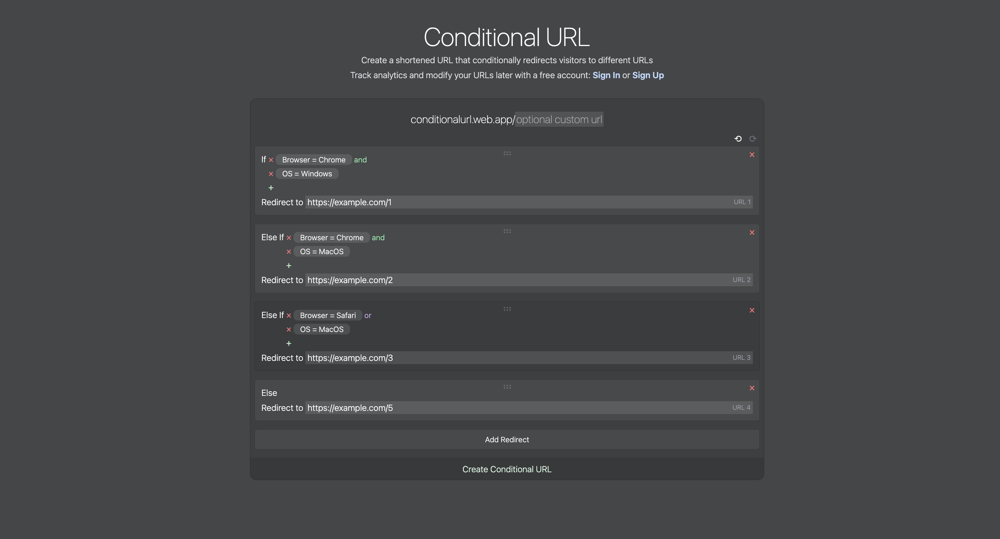

# Conditional URL

## Description
[Conditional URL](https://conditionalurl.web.app) is a link shortener app that allows you to create a url that conditionally redirects visitors based on some specified conditions. It runs serverless using AWS Lambda Functions.



## Languages and Technologies
- [Python 3](https://www.python.org/downloads/)
- [AWS Lambda](https://aws.amazon.com/lambda/)
- [AWS DynamoDB](https://aws.amazon.com/dynamodb/)
- [TypeScript](https://www.typescriptlang.org/download)
- [Vue 3](https://v3.vuejs.org/guide/introduction.html)
- [Tailwind CSS](https://tailwindcss.com/docs/guides/create-react-app)

## Installation
- Clone this repository 
```
git clone https://github.com/tamandrew/conditional-url.git
```
- Set up a [DynamoDB table](https://docs.aws.amazon.com/amazondynamodb/latest/developerguide/GettingStarted.NodeJs.html) named `urls`
- [Add the two lambda functions](https://docs.aws.amazon.com/lambda/latest/dg/getting-started.html) in `/lambda` to your AWS account.
- Set up the [Lambda functions URLs](https://docs.aws.amazon.com/lambda/latest/dg/lambda-urls.html), and enable [CORS](https://docs.aws.amazon.com/lambda/latest/dg/urls-configuration.html#urls-cors). 
- Replace the function URLs in `frontend/.env.template`, and rename the file to `.env`. 

## Running the frontend
In `/frontend`, install npm dependencies and run `npm run dev`
```
npm install
npm run dev
```
