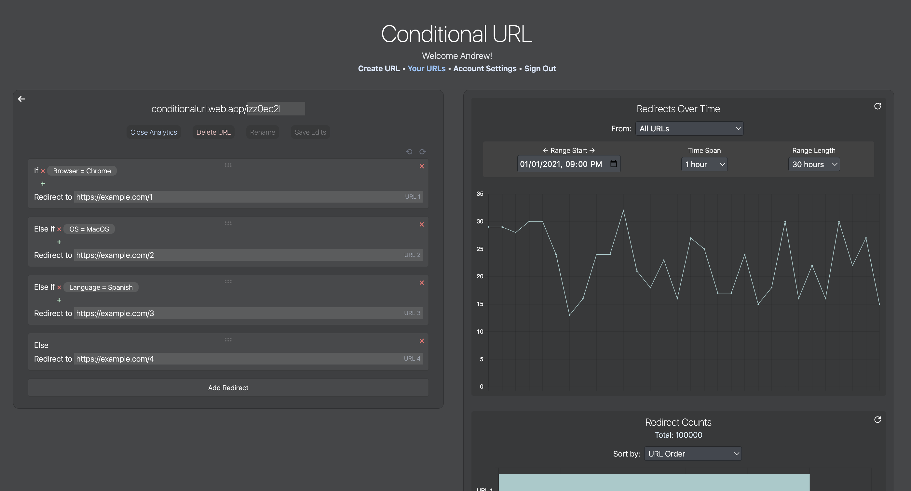

# Conditional URL

## Description
[Conditional URL](https://conditionalurl.web.app) is a link shortener app that allows you to create a shortened URL that conditionally redirects visitors to different URLs based on some specified conditions. The user can create URLs as a guest, or create an account to later edit/rename their URL and view detailed analytics. The RESTful API runs serverless using Microsoft Azure Functions.




## Technologies
- [Azure Functions](https://azure.microsoft.com/en-us/products/functions/)
- [MongoDB](https://azure.microsoft.com/en-us/services/cosmos-db/)
- [Redis](https://redis.com/redis-enterprise-cloud/overview/)
- [TypeScript](https://www.typescriptlang.org/download)
- [Vue 3](https://v3.vuejs.org/guide/introduction.html)
- [Tailwind CSS](https://tailwindcss.com/docs/guides/create-react-app)

## Installation
- Clone this repository 
```
git clone https://github.com/tamandrew/conditional-url.git
```
- Set up [Azure Functions Core Tools](https://docs.microsoft.com/en-us/azure/azure-functions/functions-run-local?tabs=windows%2Ccsharp%2Cbash). 
- For the database, this project uses MongoDB hosted on Azure Cosmos DB.
- Set up environmental variables:
    - In `/frontend`, rename `.env.template` to `.env` and change the URLs if desired.
    - In `/functions`, rename `.env.template` to `.env` and add your MongoDB connection string and a JWT Secret.
        - GOOGLE_API_KEY is optional for scanning URLs with Google's Safe Browsing API. 
            - If not provided, URLs will not be scanned before creation.
        - Redis credentials are optional for caching data.
            - If not provided, every query for analytics will have to make a database call and reprocess the data, which will be slower than using Redis.
```
cd functions
npm start
```
- To start the frontend, in `/frontend` install npm dependencies and run `npm run dev`
```
cd frontend
npm install
npm run dev
```
